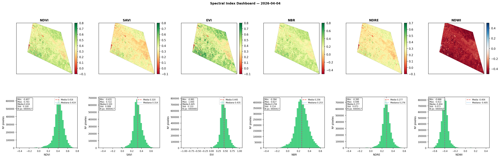
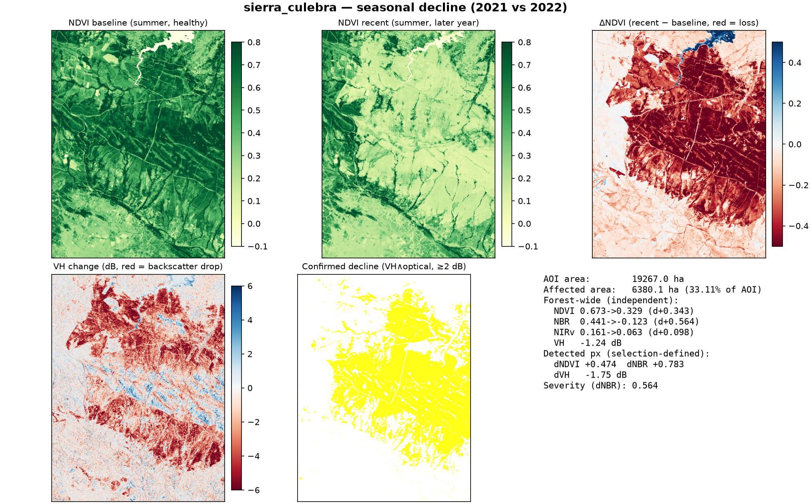
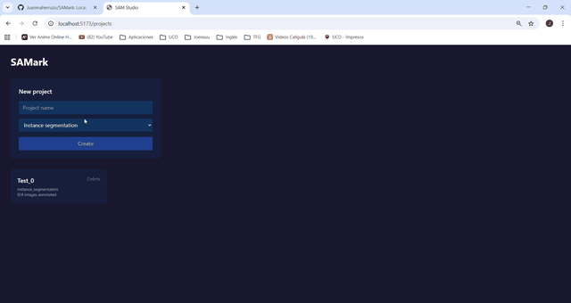

<h1 align="center">Juanma Herruzo</h1>

  <b>Forestry Engineering student building production-grade geospatial ML pipelines.</b> 
  UAV photogrammetry · Sentinel-1/2 remote sensing · deep learning for forest inventory 
  📍 Córdoba, Spain

  
  
  
  
  
  
  

---

> **The bottleneck in forestry isn't data — it's tooling.** UAV imagery, Sentinel time series, LiDAR and NDVI are already free. What's missing are pipelines a *forester* can actually run, on real datasets, on hardware they own. That's the gap I work in.

## 🛰️ Flagship projects

### 🌳 [Dehesa-Crown-Segmentation-YOLOv11](https://github.com/Juanmaherruzo/Dehesa-Crown-Segmentation-YOLOv11)
Instance segmentation of individual tree crowns on UAV orthomosaics.
**Validated on 14,506 ha → 357,185 trees detected**, with documented box & mask precision/recall/mAP.
Producer–consumer inference architecture that eliminates VRAM exhaustion on 4 GB laptop GPUs.

### 🌍 [sentinel2-spectraldex](https://github.com/Juanmaherruzo/sentinel2-spectraldex)
Sentinel-2 L2A pipeline on the free Copernicus CDSE API. AOI-driven scene search, cloud filtering,
OAuth2 with exponential backoff, in-memory MGRS tile merging, and **six spectral indices** (NDVI, SAVI, EVI, NBR, NDRE, NDWI) with a validation dashboard.

### 📡 [Sentinel-Forest-Tracker](https://github.com/Juanmaherruzo/Sentinel-Forest-Tracker)
Sentinel-1 + Sentinel-2 forest-disturbance monitoring: STAC-native Dask cube with omnibus Wishart change detection.
**Sierra de la Culebra wildfire → 6,380 ha of confirmed decline (33% of AOI)**, cross-validated between optical (ΔNDVI/ΔNBR) and SAR (VH backscatter drop).

### 🏷️ [annotation-station](https://github.com/Juanmaherruzo/annotation_station)
Local, **privacy-first** image annotation platform (FastAPI + React + SAM 2.1). Three-level embedding cache runs on 4 GB VRAM; exports to YOLO-seg, YOLO-det and COCO. Benchmarked against Roboflow, CVAT and Label Studio for the local-first use case.

---

## 🎯 Open to

`Internships in geospatial ML / precision forestry / remote sensing / computer vision (Spain or remote)` · `R&D collaborations on operational forest monitoring` · `Conversations at the intersection of forestry, earth observation & applied AI`

  
  <!-- 👉 Añade tu LinkedIn: pon tu URL y descomenta:
  
  -->

